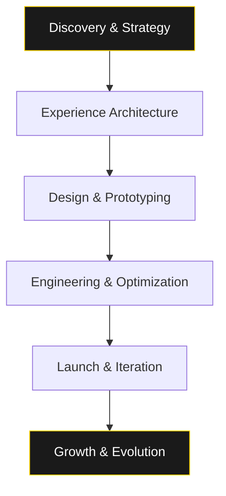

<!-- Centered Hero Section -->
<div align="center">

# 🏛️ **Q.Devnyx Studio**  
### *Architects of Digital Eminence*

---
### ✨ **Vision. Precision. Unrivaled Execution.**

**Q.Devnyx** is the **premier digital design & development studio** within the **Quarasal** ecosystem — an elite collective of strategists, designers, and engineers obsessed with transforming bold ideas into high-impact digital realities.

We don’t build websites.  
We **engineer digital legacies**.

---

## 🛠️ **Core Expertise — Engineered for Dominance**

| Discipline | Mastery |
|----------|---------|
| **Cinematic 3D Web Experiences** | Fully interactive, GPU-accelerated 3D environments powered by WebGL, Three.js, and real-time rendering. From immersive product configurators to virtual headquarters — we redefine engagement. |
| **High-Performance Enterprise Platforms** | Blazing-fast, secure, and scalable solutions built on **Next.js App Router**, React Server Components, and edge-deployed architectures. SEO-first, conversion-optimized. |
| **Strategic UI/UX Design Systems** | Data-informed, human-centered design. We craft intuitive interfaces backed by user research, heatmaps, A/B testing, and behavioral analytics. Frictionless journeys. Measurable results. |
| **Luxury Brand Identity & Digital Storytelling** | Cohesive visual systems, bespoke typography, motion language, and narrative frameworks. We don’t design logos — we architect **brand gravity**. |

---

> **“Excellence is not an act. It’s a habit.”**  
> Every line of code, every micro-interaction, every frame is deliberate. This is **Q.Devnyx Standard**.

---

## ⚡ **Technical Excellence — By Design**

- **Performance Obsessed** — 100/100 Lighthouse scores. Core Web Vitals guaranteed.  
- **Future-Proof Architecture** — Modular, headless-ready (Vercel, Cloudflare, AWS), API-first.  
- **AI-Enhanced Workflows** — Automated accessibility, smart content personalization, predictive UX.  
- **Security by Default** — OWASP-compliant, zero-trust infrastructure, SOC 2-ready pipelines.  
- **Global CDN Delivery** — Sub-50ms latency worldwide.  

---

## 🏆 **Who We Serve**

We partner exclusively with **visionary leaders**, **disruptive startups**, and **iconic institutions** who refuse to blend in:

- Fortune 500 executives launching flagship digital transformations  
- Luxury brands seeking unparalleled online prestige  
- Tech innovators needing bulletproof, scalable platforms  
- Cultural institutions reimagining audience connection  

---

## 🔬 **Our Process — The Q.Devnyx Method™**


💼 Case Studies (Selected)


ClientOutcomeAether Capital340% increase in investor inquiries post-launch; 1.2s load timeLuxe AtelierFirst luxury e-commerce site with real-time 3D try-on; 78% cart recoveryNova InstituteAward-winning interactive annual report; 2.1M global impressions

🎯 Ready to Command the Digital Frontier?
Your ambition deserves a partner that delivers beyond expectation.
Let’s architect the future — together.

  ```

  Q.Devnyx Studio • A Quarasal Division  
  © 2025 • All Rights Reserved • Built for Eternity


```
